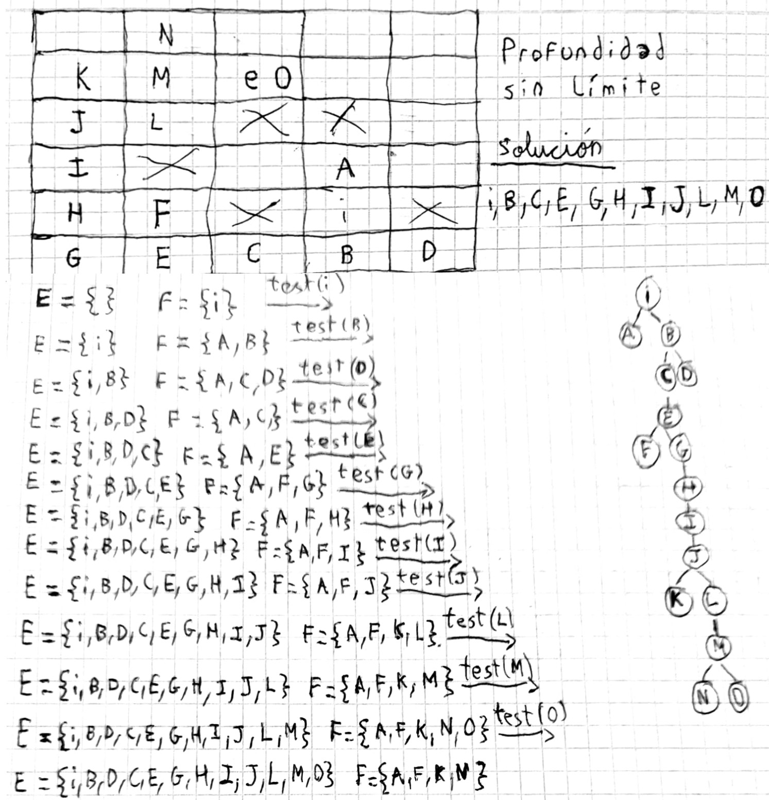
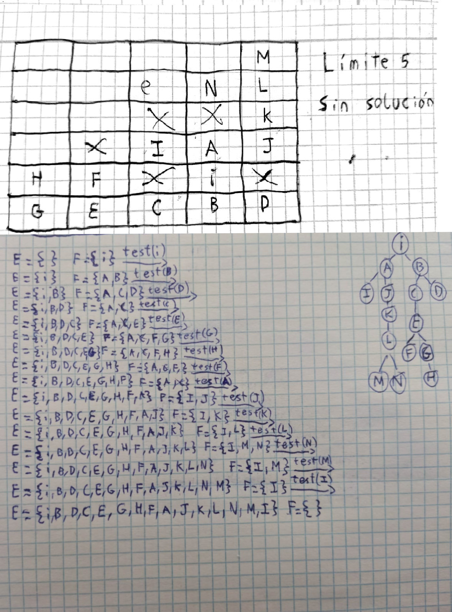
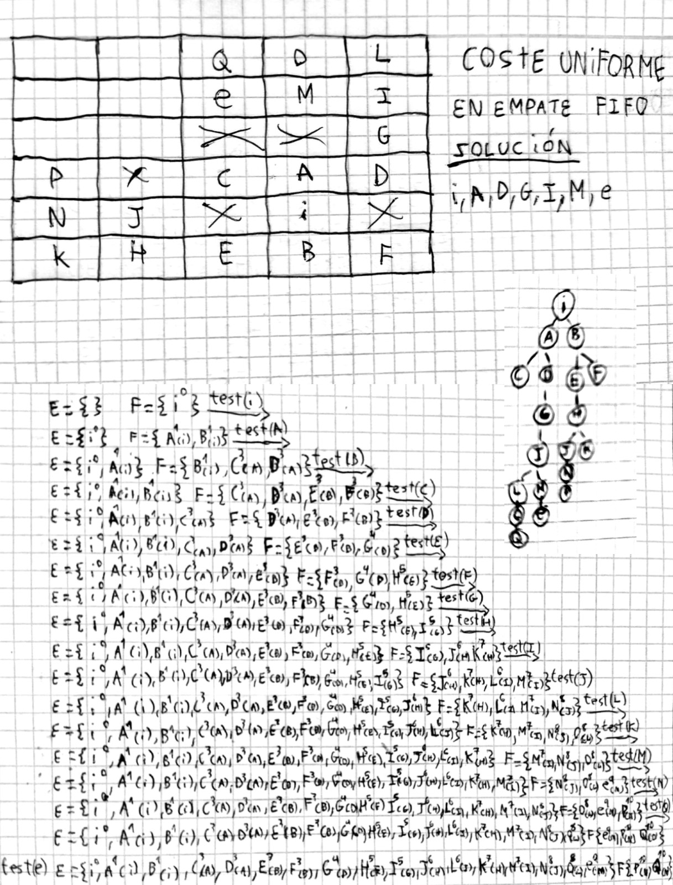
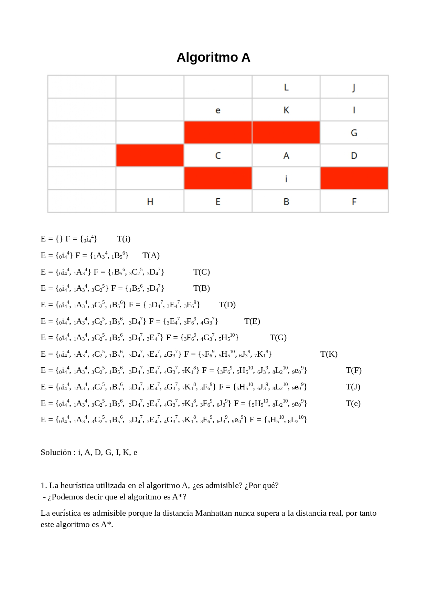

## Búsqueda profundidad sin límite

## Búsqueda profundidad limite 5

### Preguntas específicas:

1. En la búsqueda en profundidad, el límite de profundidad es 5:
   - Describe qué sucede.
   - Indica el tipo de fracaso (si lo hay).
   - ¿Qué sucede si aumentamos el límite de profundidad a 6?

**Repuesta** :

En el límite 5 no llega a ninguna solución, es un fracaso por corte que arreglaríamos al aumentar la profundidad 6.

## Búsqueda coste uniforme npc

## Búsqueda coste uniforme Ourense-Calatayud

## Búsqueda A*

